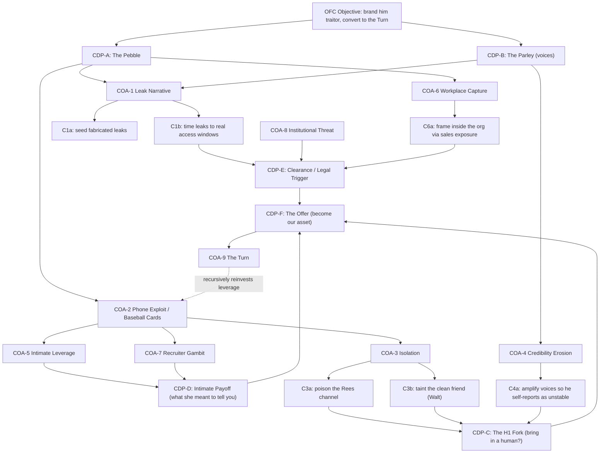

# Adversary COA Tree (the OFC)

The antagonist-strategy layer of the bible. Everything in this file is **in-story design**: it describes what the adversary is doing to the protagonist as narrative machinery — what each move buys them dramatically — not operational instruction. Author's canon is the source of truth; provisional labels are flagged.

## The framework (OFC) and objective

- **OFC** — the adversary's *Operational Framework* (provisional expansion; if OFC is a named doctrine, cell, or person in canon, relabel the root and keep the structure).
- **Trunk / objective:** brand the protagonist a **traitor** — a leaker of top-secret information — then convert that brand into total control: **the Turn**, where being a traitor becomes so complete that his only exit is to actually become their asset. The design deliberately mirrors the tradecraft he learned overseas: the multi-year cognitive development campaign, now aimed at him.
- **Fractal principle:** each COA is a branch; each branch sprouts sub-tactics; sub-tactics re-converge at shared **Critical Decision Points (CDPs)**. Because one CDP is fed by several COAs, the structure is a lattice, not a pure tree — and that recursion is where leverage compounds.

## The 9 COAs

- **COA-1 Leak Narrative** — manufacture the appearance he leaked classified information; align the fabricated "leaks" against his real historical access windows so the timeline looks damning.
- **COA-2 Phone Exploitation / Baseball Cards** — the compromised phone yields dossiers ("baseball cards") on every contact. This is the **fractal hub**: it supplies tailored pressure to nearly every other COA.
- **COA-3 Isolation** — sever or poison his trusted relationships (the Rees channel; taint the one clean friend, Walt) so he cannot run the H1 discriminating test.
- **COA-4 Credibility Erosion** — paint him as paranoid/unstable so any testimony he gives is discounted in advance; "traitor or crazy," and both outcomes discredit him.
- **COA-5 Intimate Leverage** — exes and the ex's mother; the "what she meant to tell you" hook from Chapter Two.
- **COA-6 Workplace Capture** — the Company / Vigil; the sales-roster exposure that walked him past everyone; frame him from inside the org.
- **COA-7 Recruiter Gambit** — Rees as handler or unwitting vector; the founding phone call reinterpreted as move one.
- **COA-8 Institutional Threat** — clearance review / legal / treason framing that brings the state onto the board as a piece.
- **COA-9 The Turn** — terminal COA; all accumulated leverage converges into the recruitment offer.

## Critical Decision Points (intersection nodes)

- **CDP-A The Pebble** — "that's the guy who made Vigil" (entry).
- **CDP-B The Parley** — the bathroom voices (contact established).
- **CDP-C The H1 Fork** — does he bring in a trusted human? The hinge of the middle act.
- **CDP-D Intimate Payoff** — "what she meant to tell you."
- **CDP-E Clearance / Legal Trigger.**
- **CDP-F The Offer** — the Turn.

## The multifractal COA tree

## Maximum-leverage analysis

- **CDP-F The Offer** has the highest in-degree (all three mid-tier CDPs feed it) — it is where leverage is *spent*.
- **CDP-C The H1 Fork** is the adversary's true **center of gravity**: COA-3 and COA-4 both exist mainly to win it. If the protagonist wins CDP-C — brings in a genuinely external human and compares notes against the world — the keystone falls and most of the tree collapses. So the antagonist's point of maximum leverage and the protagonist's point of maximum defense are the *same node*: the H1 hinge. That convergence is the thematic payoff and should be staged as the book's midpoint.
- **COA-2** is the fractal hub: the "baseball cards" reappear as a sub-input to nearly every branch, and COA-9 recursively reinvests captured leverage back into COA-2, which is how the campaign compounds over time — his own multi-year-recruitment knowledge made literal and turned against him.

## Chapter dramatization (cross-reference; see `timeline.md`)

- COA-6 / COA-7 — retro-read in the Chapter Three flashback (the recruitment call; the sales-first onboarding).
- COA-1 / COA-2 — surface after the Parley, once the "baseball cards" reveal lands.
- COA-3 / COA-4 — collide at the CDP-C midpoint (the fight over whether he brings in a human).
- COA-8 — escalation into the third act (the state enters).
- COA-9 — the climax (the Offer).
